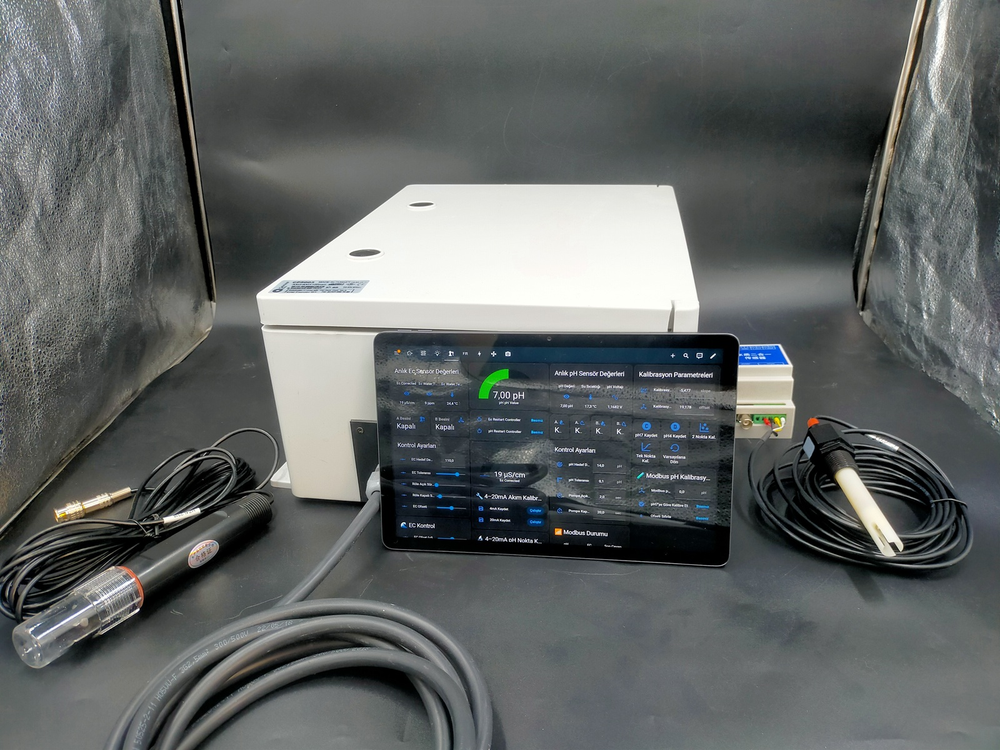

📘 HYDROSMART PRO
📞 TEKNİK DESTEK: 5337421687
    www.drelitegrow.com
⚠️ Bu kılavuzdaki tüm teknik terimler endüstriyel standartları ifade eder.
   Cihaz, akıllı karar katmanı ve güvenli PLC mimarisi ile çalışır.
   

Besleme Sürecini Yöneten Endüstriyel Kontrol Platformu
KULLANIM KILAVUZU
İÇİNDEKİLER
Güvenlik Uyarıları

Ürün Tanımı

Teknik Özellikler

Kutu İçeriği

Montaj ve Bağlantılar

5.1. Bağlantı Şeması

5.2. Röle Çıkışları (Kuru Kontak)

5.3. Sensör Bağlantıları (Modbus RTU)

5.4. Seviye Sensörü Bağlantıları

5.5. Acil Durdurma Butonu Bağlantısı

İlk Kurulum ve Eşleştirme

6.1. Cihazın Enerjilendirilmesi

6.2. Kablosuz Arayüze Bağlantı

Arayüz ve Kontroller

7.1. Ana Ekran

7.2. Durum Göstergeleri

7.3. Butonlar

Çalışma Modları

8.1. 🌱 Standart Mod (Zaman Tabanlı)

8.2. ⚡ Prof Mod (Sensör Tabanlı)

Sensör Kalibrasyonu

9.1. pH Kalibrasyonu

9.2. EC Kalibrasyonu

Arayüz Elemanları ve Ayarlar

10.1. PROF Mod Ayarları

10.2. STANDART Mod Ayarları

10.3. C Pompası Planlı Çalışma

10.4. Güvenlik Limitleri ve Zaman Aşımları

Sık Karşılaşılan Sorunlar ve Çözümleri

Bakım

İletişim ve Destek

1. GÜVENLİK UYARILARI
Elektrik Çarpması Riski: Cihazın montajı ve bağlantıları yetkili personel tarafından yapılmalıdır. Bağlantı işlemlerinden önce cihazın enerjisinin kesik olduğundan emin olun.

Kuru Kontak Çıkışları: Röle çıkışları kuru kontaktır (potansiyelsiz). Yüksek güçlü cihazları (pompa, vana, motor vb.) doğrudan sürmek için uygun kontaktör veya röleler kullanılmalıdır. Uygunsuz bağlantı cihaza ve bağlı ekipmanlara zarar verebilir.

Kullanım Amacı: Cihaz sadece hidroponik besleme süreçlerini kontrol etmek için tasarlanmıştır. Amacı dışında kullanım, tehlikeli durumlara yol açabilir.

Sıvılardan Koruyun: Cihazı nemden, su sıçramalarından ve doğrudan güneş ışığından koruyun.

Acil Durum: Sistemde bir arıza veya acil bir durumda, acil durdurma butonuna basın veya cihazın enerjisini kesin.

2. ÜRÜN TANIMI
HYDROSMART PRO, klasik sulama panolarından farklı olarak sahadaki pompa ve vanaları doğrudan sürmeyen, onlara ne zaman ve nasıl çalışacaklarını söyleyen gelişmiş bir kontrol platformudur. Kuru kontak çıkışları sayesinde mevcut her türlü elektrik altyapısına kolayca entegre olur.

Ürünün temel amacı, hidroponik sistemlerde besin çözeltisini (tanktaki suyu) her seferinde aynı kalitede, tekrarlanabilir ve izlenebilir bir şekilde hazırlamaktır. EC (elektriksel iletkenlik) ve pH değerlerini anlık ölçüp analiz ederek, gereksiz gübre kullanımını azaltır ve bitkiler için en ideal ortamı oluşturur.

3. TEKNİK ÖZELLİKLER
Genel
Özellik	Değer
Besleme Gerilimi	12-24V DC
Çalışma Sıcaklığı	-20°C - +60°C
Kontrol Mimarisi	Akıllı Karar Katmanı + PLC Destekli Güvenli IO
Haberleşme	Wi-Fi (kablosuz arayüz bağlantısı)
Kuru Kontak Çıkışı	10 Röle (NO - Normalde Açık)
Maks. Röle Akımı	6A (Dirençli yükte)
pH Ölçüm
Özellik	Değer
Ölçüm Aralığı	0.00 - 14.00 pH
Hassasiyet	±0.05 pH
Çözünürlük	0.01 pH
Kalibrasyon	Tek Nokta (7.0 pH)
Sıcaklık Telafisi	Otomatik
EC (İletkenlik) Ölçüm
Özellik	Değer
Ölçüm Aralığı	0 - 20000 µS/cm
Hassasiyet	±%2 F.S.
Çözünürlük	1 µS/cm
Kalibrasyon	Tek Nokta (1413 µS)
Sıcaklık Telafisi	Otomatik (β=%2/°C)
Sıcaklık Ölçüm (PT100)
Özellik	Değer
Ölçüm Aralığı	-50°C - 150°C
Hassasiyet	±0.5°C
Çözünürlük	0.1°C
4-20mA analog çıkış (opsiyonel PLC entegrasyonu için) |

5. KUTU İÇERİĞİ
📦 HYDROSMART PRO Kontrol Ünitesi
📦 pH/EC/Sıcaklık Transmitteri (RS-485 Modbus + 4-20mA çıkışlı)
📦 pH Probu
📦 EC Probu
📦 PT100 Sıcaklık Probu
📦 Kullanım Kılavuzu
📦 Montaj Aparatı

5.2. Röle Çıkışları (Kuru Kontak)
Tüm röle çıkışları potansiyelsiz (kuru kontak) olup "Normalde Açık" (NO) konfigürasyondadır. Bağlayacağınız pompa, vana veya motorun güç gereksinimine göre harici kontaktör veya güç rölesi kullanmanız kesinlikle önerilir.

Röle	Fonksiyon	Açıklama
R1	NPK-A Pompası	EC yükseltmek için kullanılan A besin pompası.
R2	NPK-B Pompası	EC yükseltmek için kullanılan B besin pompası.
R3	NPK-C Pompası	Planlı/Günlük/Haftalık ek besleme pompası.
R4	Asit Pompası	pH düşürmek için kullanılan asit pompası.
R5	Karıştırıcı Motor	Tanktaki suyu karıştıran motor.
R6	Sulama Pompası	Hazırlanan suyu bitkilere gönderen pompa.
R7	Dolum Valfi	Tankı dolduran vana.
R8	Alarm	Herhangi bir hata veya acil durumda aktif olan alarm çıkışı.

6.2. Kablosuz Arayüze Bağlantı

Tablet veya bilgisayarınızdan cihazın yayınladığı Wi-Fi ağına bağlanın.
Tarayıcınızı açıp http://hydrosmart.local adresine gidin.
Açılan sayfada kendi Wi-Fi ağınızın bilgilerini girerek cihazı ev/ofis ağınıza ekleyin.
Home Assistant kullanıyorsanız, entegrasyon otomatik olarak algılanacaktır.
Eşleştirme tamamlandıktan sonra tüm sensörler, butonlar ve kontroller arayüzünüze otomatik olarak eklenecektir.

7.1. Ana Ekran
Ana ekranda sistemin anlık durumunu gösteren temel bilgiler bulunur:

Çalışma Modu: Sistemin hangi modda (Standart/Prof) çalıştığı.

Sistem Mesajı: Anlık işlem, hata veya uyarı mesajları.

Ek ayrıntılar: Aktif döngünün hangi aşamada olduğu ve geçen süre.

Mod Durumu: Çalışma modu, transmitter durumu, döngü durumu ve mod kodu.

7.2. Durum Göstergeleri
EC Değeri (µS/cm): Anlık olarak ölçülen, sıcaklık telafili EC değeri.

pH Değeri: Anlık olarak ölçülen, sıcaklık telafili pH değeri.

Sıcaklık Değeri (°C): PT100 sensöründen okunan anlık sıcaklık.

EC/pH Sensör Bağlı: Sensörlerin bağlantı durumunu gösterir.

Döngü Aktif: Sistemin bir besleme döngüsü çalıştırıp çalıştırmadığı.

Alarm Aktif: Herhangi bir alarm durumu olup olmadığı.

7.3. Butonlar
Buton	Fonksiyon
Döngü Başlat	Seçili modda (Standart/Prof) bir besleme döngüsü başlatır.
Döngüyü Durdur	Devam eden döngüyü güvenli bir şekilde durdurur.
Sulamayı Başlat	Stabilizasyon aşamasında beklemedeyken sulamayı manuel başlatır.
Sulamayı Onayla	Manuel onay modu aktifken sulamayı onaylar.
Acil Durdurma Reset	Acil durdurma butonuna basıldıktan sonra sistemi normale döndürür.
A Pompa (1sn) / B Pompa (1sn) / C Pompa (1sn) / Asit Pompa (1sn)	Pompaları test etmek için 1 saniyeliğine çalıştırır.
pH 7.0 Kalibrasyon / EC 1413 Kalibrasyon	Sensör kalibrasyonunu başlatır.
Dozaj Sıfırla	EC, pH ve karıştırma sayaçlarını sıfırlar.
Alarmları Temizle / Alarm Sessize Al	Aktif alarmları kapatır veya sessize alır.
8. ÇALIŞMA MODLARI
HYDROSMART PRO iki farklı çalışma modu sunar.

8.1. 🌱 Standart Mod (Zaman Tabanlı)
Bu mod, öngörülebilir ve tekrarlanabilir bir işletme yapısı isteyen kullanıcılar için idealdir.

Çalışma Prensibi: Sistem, önceden tanımlanmış sürelere göre sıralı bir döngü çalıştırır.

Sensör Kullanımı: Sensörler, döngünün başında kontrol amaçlı kullanılır ve güvenli sonlandırma için izlenir, ancak dozaj miktarına doğrudan etki etmezler.

Döngü Akışı:

Sensör Isınma: Transmitter aktif edilir, sensörlerin stabilize olması beklenir (15 sn).
Tank Dolum: Dolum vanası açılır, tank dolar (Zaman aşımı veya seviye sensörü ile sonlanır).
A Dozajı: A pompası ayarlanan süre kadar çalışır.
Karıştırma-1: Karıştırıcı ayarlanan süre kadar çalışır.
B Dozajı: B pompası ayarlanan süre kadar çalışır.
Karıştırma-2: Karıştırıcı ayarlanan süre kadar çalışır.
Asit Dozajı: Asit pompası ayarlanan süre kadar çalışır.
Final Karıştırma: Karıştırıcı ayarlanan süre kadar çalışır.
Stabilizasyon: Karıştırıcı durur, çözeltinin stabilize olması beklenir.
Sulama: Sulama pompası ayarlanan süre kadar çalışır ve döngü tamamlanır.
Kullanım Alanı: Standart reçetelerle çalışan, farklı bitki türleri için sabit formüller uygulayan ticari üreticiler.

8.2. ⚡ Prof Mod (Sensör Tabanlı)
Bu mod, sistemin davranışını analiz ederek dozaj miktarını otomatik olarak ayarlayan gelişmiş kontrol modudur.

Çalışma Prensibi: Sistem, EC ve pH sensörlerinden gelen anlık verilere göre karar verir. Hedef değerlerin altında veya üstünde olan parametreler için mikro dozajlar uygulayarak kademeli düzeltme yapar. Amaç, sert müdahalelerden kaçınarak stabil ve sürdürülebilir bir çözelti elde etmektir.

Sensör Kullanımı: Sensörler sistemin beynidir. Tüm karar mekanizması sensör verilerine dayanır.

Döngü Akışı:

Sensör Isınma & Kontrol (Mod -10): Sensör bağlantıları kontrol edilir, stabilize olmaları beklenir.
Tank Dolum (Mod 1): Tank doldurulur.
EC Kontrol (Mod 2): EC değeri ölçülür. Hedef aralıkta mı?
Evet → pH Kontrol'e geç (Mod 4).
Düşük → EC Dozaj'a geç (Mod 3).
Yüksek → pH Kontrol'e geç (Mod 4).
EC Dozaj (Mod 3): A ve B pompaları sırayla çalışır. Her dozdan sonra karıştırma ve bekleme yapılır.
pH Kontrol (Mod 4): pH değeri ölçülür. Hedef aralıkta mı?
Evet → Stabilizasyon'a geç (Mod 6).
Yüksek → pH Dozaj'a geç (Mod 5).
Düşük → Stabilizasyon'a geç (Not: Baz pompası yoksa uyarı verir).
pH Dozaj (Mod 5): Asit pompası ayarlanan süre kadar çalışır. Her dozdan sonra karıştırma ve bekleme yapılır.
Son Kontrol (Mod 7): EC ve pH tekrar kontrol edilir. Eğer değerler hala hedef aralıkta değilse, ilgili dozaj moduna geri dönülür. Bu döngü, değerler hedef aralığa gelene veya maksimum dozaj sayısına ulaşana kadar devam eder.
Stabilizasyon (Mod 6): Çözeltinin stabilize olması için son bir kez karıştırılır ve beklenir. (Manuel onay modu aktifse kullanıcı onayı beklenir).
Sulama (Mod 13): Sulama pompası ayarlanan süre kadar çalışır ve döngü tamamlanır.
Kullanım Alanı: Su kalitesi değişkenlik gösteren, farklı besin formülleriyle çalışan veya optimum verim için çözelti dengesini sürekli korumak isteyen profesyonel üreticiler.

9. SENSÖR KALİBRASYONU
Doğru ölçümler için sensörlerin düzenli olarak kalibre edilmesi gerekir (Önerilen: Ayda 1).

9.1. pH Kalibrasyonu
pH probunu 7.0 pH kalibrasyon solüsyonuna daldırın.

Birkaç saniye bekleyin (ekrandaki değerin stabil hale gelmesi için).

Panel veya web arayüzünden "pH 7.0 Kalibrasyon" butonuna tıklayın.

İşlem tamamlandığında ekranda "pH 7.0 kalibrasyonu yapıldı" mesajı görünecektir.

9.2. EC Kalibrasyonu
EC probunu 1413 µS/cm kalibrasyon solüsyonuna daldırın.

Probu hafifçe hareket ettirerek üzerindeki hava kabarcıklarının çıkmasını sağlayın ve değerin stabil hale gelmesini bekleyin.

Panel veya web arayüzünden "EC 1413 Kalibrasyon" butonuna tıklayın.

İşlem tamamlandığında ekranda "EC 1413 kalibrasyonu yapıldı" mesajı görünecektir.

Not: Kalibrasyon öncesinde mevcut kalibrasyonu sıfırlamak için "EC Kalibrasyon Sıfırla" butonu kullanılabilir.

10. ARAYÜZ ELEMANLARI VE AYARLAR
10.1. PROF Mod Ayarları
Ayar	Açıklama
Hedef pH	Ulaşılmak istenen pH değeri (Örn: 5.8).
pH Tolerans	Hedef pH'dan izin verilen sapma miktarı (Örn: 0.15).
Hedef EC	Ulaşılmak istenen EC değeri (µS/cm) (Örn: 1200).
EC Tolerans	Hedef EC'den izin verilen sapma miktarı (Örn: 50).
A Pompası Çalışma Süresi	EC düşük olduğunda A pompasının her bir dozda çalışacağı süre (saniye).  (prof modda)
A Pompası Bekleme Süresi	A pompası dozajları arasında beklenecek süre (saniye).  (prof modda)
B Pompası Çalışma Süresi	EC düşük olduğunda B pompasının her bir dozda çalışacağı süre (saniye).  (prof modda)
B Pompası Bekleme Süresi	B pompası dozajları arasında beklenecek süre (saniye).  (prof modda)
Asit Pompası Çalışma Süresi	pH yüksek olduğunda asit pompasının her bir dozda çalışacağı süre (saniye).  (prof modda)
Asit Pompası Bekleme Süresi	Asit pompası dozajları arasında beklenecek süre (saniye).  (prof modda)
Karıştırma Süresi	Her dozajdan sonra karıştırıcının çalışacağı süre (saniye).
Stabilizasyon Bekleme	Karıştırma sonrası çözeltinin stabilize olması için beklenecek süre (saniye).
Onay Bekleme Süresi	Manuel onay modunda, kullanıcının sulamayı onaylaması için beklenen maksimum süre (saniye).
Maksimum EC Dozaj	Bir döngüde yapılabilecek maksimum EC dozaj sayısı.
Maksimum pH Dozaj	Bir döngüde yapılabilecek maksimum pH dozaj sayısı.
Maksimum Karıştırma	Bir döngüde yapılabilecek maksimum karıştırma sayısı.

10.2. STANDART Mod Ayarları
Ayar	Açıklama
Tank Dolum Süresi	Tankın dolması için beklenen maksimum süre (saniye). Süre sonunda vana kapanır ve döngü devam eder.
Sulama Süresi	Sulama pompasının çalışacağı süre (saniye).
Ölçüm Bekleme	Sensörlerin ölçüm yapması için beklenecek süre (saniye).
A Pompası Çalışma Süresi	Standart döngüde A pompasının çalışacağı süre (saniye).
B Pompası Çalışma Süresi	Standart döngüde B pompasının çalışacağı süre (saniye).
Asit Pompası Çalışma Süresi	Standart döngüde asit pompasının çalışacağı süre (saniye).
C Pompası Çalışma Süresi	Standart döngüde C pompasının çalışacağı süre (saniye).
Karıştırma Süresi	Standart döngüde karıştırıcının çalışacağı süre (saniye).
Stabilizasyon Süresi	Standart döngüde son karıştırma sonrası beklenecek süre (saniye).

10.3. C Pompası Planlı Çalışma
Bu pompa, ana döngüden bağımsız olarak periyodik ek besleme yapmak için kullanılır.
Ayar	Açıklama
C Pompası Modu	Pasif, Günlük veya Haftalık.
C Pompası Günü	Haftalık modda pompanın çalışacağı gün.
C Pompası Çalışma Saati	Pompanın çalışacağı saat (tam saatte çalışır).

10.4. Güvenlik Limitleri ve Zaman Aşımları
Ayar	Açıklama
Tank Dolum Timeout	Tank dolum aşamasında maksimum bekleme süresi. Aşılırsa alarm verir ve döngü durur.
EC Ölçüm Timeout	EC ölçüm aşamasında maksimum bekleme süresi.
EC Dozaj Timeout	EC dozaj aşamasında maksimum bekleme süresi.
pH Ölçüm Timeout	pH ölçüm aşamasında maksimum bekleme süresi.
pH Dozaj Timeout	pH dozaj aşamasında maksimum bekleme süresi.
Stabilizasyon Timeout	Stabilizasyon aşamasında maksimum bekleme süresi.
Sulama Ek Timeout	Sulama aşamasında ek bekleme süresi.

11. SIK KARŞILAŞILAN SORUNLAR VE ÇÖZÜMLERİ
Sorun	Olası Neden	Çözüm
Cihaz Home Assistant'da görünmüyor.	Wi-Fi bağlantı sorunu, cihaz enerjisiz.	Cihazın enerjisini kontrol edin. Modeminizi ve cihazı yeniden başlatın.
EC/pH değerleri okunmuyor veya "NAN" görünüyor.	Sensör bağlantı sorunu, transmitter enerjisiz, yanlış Modbus adresi.	Transmitter bağlantılarını (A, B, GND) ve beslemesini kontrol edin. Transmitter üzerindeki adresin 1 olduğundan emin olun.
EC değeri çok düşük veya çok yüksek gösteriyor.	Sensör kirlenmiş, kalibrasyon bozulmuş, prob arızalı.	Probu temizleyin. 1413 µS solüsyonu ile kalibrasyonu tekrarlayın. Probun kullanım ömrünü kontrol edin.
pH değeri çok düşük veya çok yüksek gösteriyor.	Sensör kirlenmiş, kalibrasyon bozulmuş, prob arızalı, referans elektroliti bitmiş.	Probu temizleyin. 7.0 pH solüsyonu ile kalibrasyonu tekrarlayın. Prob bakımını yapın veya değiştirin.
Pompalar çalışmıyor.	Röle bağlantı sorunu, harici kontaktör arızası, ayarlar yanlış.	Röle çıkışlarındaki kuru kontak bağlantılarını ve harici kontaktörü kontrol edin. Home Assistant'ta ilgili pompanın aktif/pasif durumunu kontrol edin.
Döngü başlamıyor veya takılıp kalıyor.	Acil durdurma aktif, tank boş, sensör hatası, zaman aşımı.	Acil durdurma butonunu kontrol edip resetleyin. Tank seviyesini kontrol edin. Log'lardan hata mesajını okuyun.
Sistem sürekli asit/EC dozajı yapıyor, hedefe ulaşamıyor.	Maksimum dozaj limiti çok yüksek, hedef değer çok iddialı, dozaj süreleri çok kısa.	Maksimum dozaj limitlerini kontrol edin. Hedef değerleri bitki türüne göre optimize edin. Dozaj sürelerini artırın.
Manuel onayda zaman aşımı oluyor.	Kullanıcı onay vermedi, onay bekleme süresi çok kısa.	Sulamayı onaylamak için "Sulamayı Onayla" butonuna basın. Ayarlardan onay bekleme süresini uzatın.

13. BAKIM
Sensör Temizliği: EC ve pH problarını düzenli olarak temiz suyla durulayın ve yumuşak bir bezle kurulayın. Kireç veya tortu oluşumu varsa, hafif bir deterjan veya özel temizleme solüsyonu kullanabilirsiniz.

Kalibrasyon: Doğru ölçümler için probları ayda en az bir kez kalibre edin.

Kablolar: Tüm kablo bağlantılarını periyodik olarak kontrol edin. Gevşemiş veya hasar görmüş kablo olup olmadığını inceleyin.

13. İLETİŞİM VE DESTEK
HYDROSMART PRO'nuzla ilgili her türlü soru, sorun veya öneri için bize ulaşabilirsiniz.

Ürünümüzü tercih ettiğiniz için teşekkür ederiz. İyi çalışmalar!
